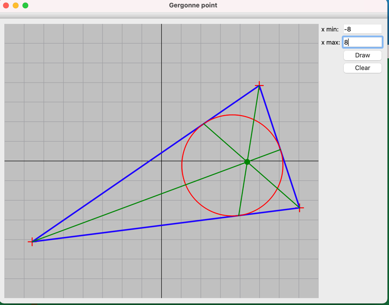

mechmath_cxx_homework
ДЗ C++ Романов Андрей Мехмат магистр 1 курс
Задание:
Нарисовать треугольник и точку Жергона — пересечение отрезков, соединяющих вершины треугольника с точками касания вписанной окружности.

Инструкция по запуску

Через интерфейс Qt Creator

Полученное озображение:  
